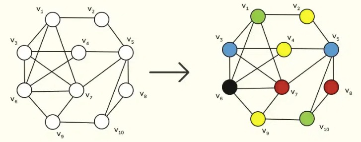
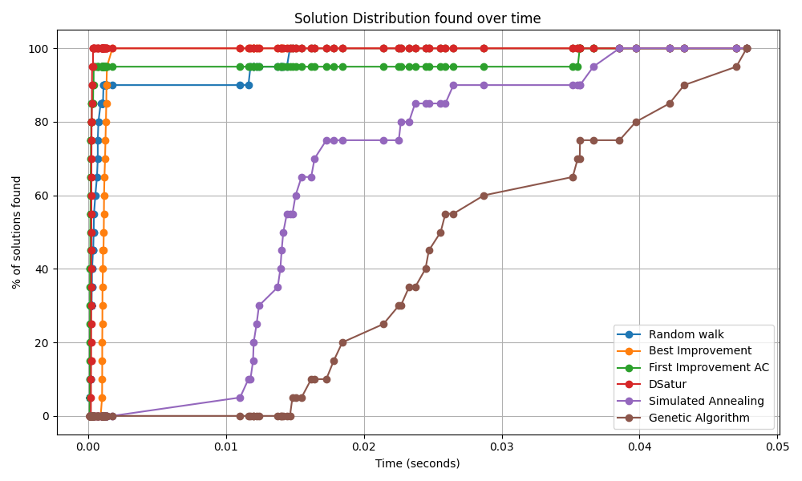

# Graph-Coloring-Strategies

This repository contains an experimental implementation of several **graph coloring strategies**, with the aim of exploring and comparing different approaches to solving the graph coloring problem.

## About the Project

The graph coloring problem involves assigning colors to the vertices of a graph such that no two adjacent vertices share the same color. Efficient solutions are important in scheduling, register allocation in compilers, and frequency assignment in wireless networks.

This project implements multiple strategies to solve the problem, benchmarks them, and provides a visualization of their performance.

## Repo Structure

This repository has the following files and directories:

* `main.py`: Main file that executes the strategies and benchmark.
* `classes/`: Directory containing auxiliary classes for implementing strategies.
* `README.md`: This file, containing information about the project.
* `img/`: Contains an image of the graph used in the experiment and an image of the benchmark.

## How to Run

To run this project, follow the steps:

1.  **Clone** the repository to your local machine:
    ```bash
    git clone https://github.com/Jefferson13t/Graph-Coloring-Strategies.git
    ```
2.  **Navigate** to the project directory:
    ```bash
    cd Graph-Coloring-Strategies
    ```
3.  **Run** the main file:
    ```bash
    python main.py
    ```
    This will create a benchmark plot of the implemented strategies and add it to the `output` folder.

**Note:** Make sure you have **Python** installed on your machine before running the project, along with the **`numpy`** and **`matplotlib`** libraries.

## Implemented Strategies

The repository implements several graph coloring strategies, including:

* **Constructive Heuristics:**
    * **DSatur:** (Saturation Degree) A well-known heuristic that prioritizes coloring vertices with the highest number of differently colored neighbors.
* **Local Search Algorithms:**
    * **Random Walk:** A basic local search that explores the solution space by making random valid moves.
    * **Best Improvement:** A greedy local search that selects the move (recoloring a single vertex) that results in the largest reduction in the number of constraint violations (conflicts).
    * **First Improvement:** A local search that accepts the first move (recoloring) that leads to an improvement in the objective function.
* **Metaheuristics:**
    * **Simulated Annealing:** A probabilistic technique that explores the solution space, accepting non-improving moves based on a decreasing **Temperature** and a **Cooling Rate** (e.g., `initial_temperature = 10`, `cooling_rate = 0.9`).
    * **Genetic Algorithm:** A nature-inspired optimization method that uses concepts like **Population** (`individual_number = 100`), **Generations** (`generation_number = 500`), and **Mutation Rate** (`mutation_rate = 0.05`) to evolve high-quality colorings.

Each strategy is implemented as a separate class in the classes/ directory that inherits from the abstract ColoringStrategy class, allowing for easy extension and modification.

## Results

### Instance Graph

The strategies benchmark was executed on a **specific graph instance**, visualized below.



### Benchmark Analysis

The benchmark plot compares the **execution time** and the **number of colors** used by the different strategies to color the graph instance above. The results highlight the **efficiency** of the heuristics relative to the exact methods for this instance:



Feel free to explore the implementations and contribute with new strategies!